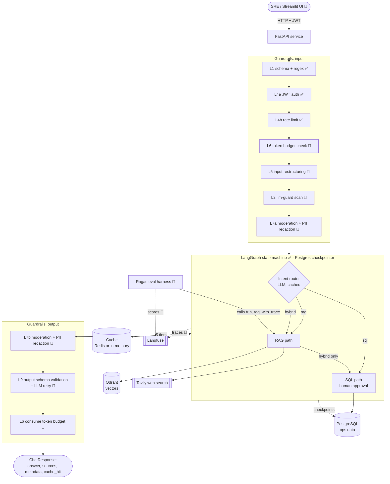
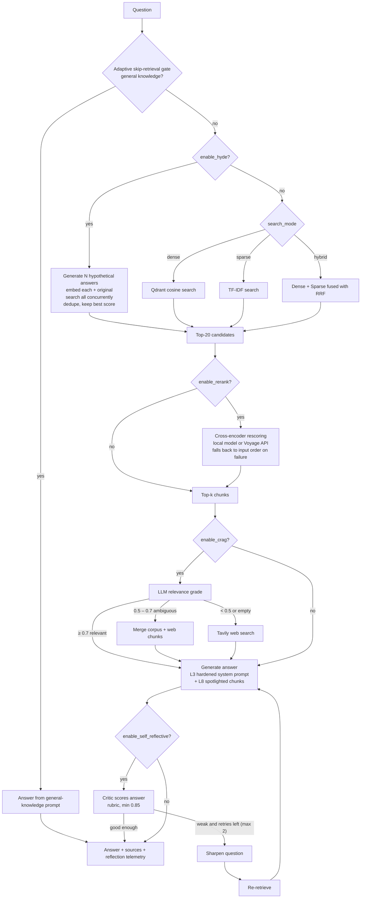
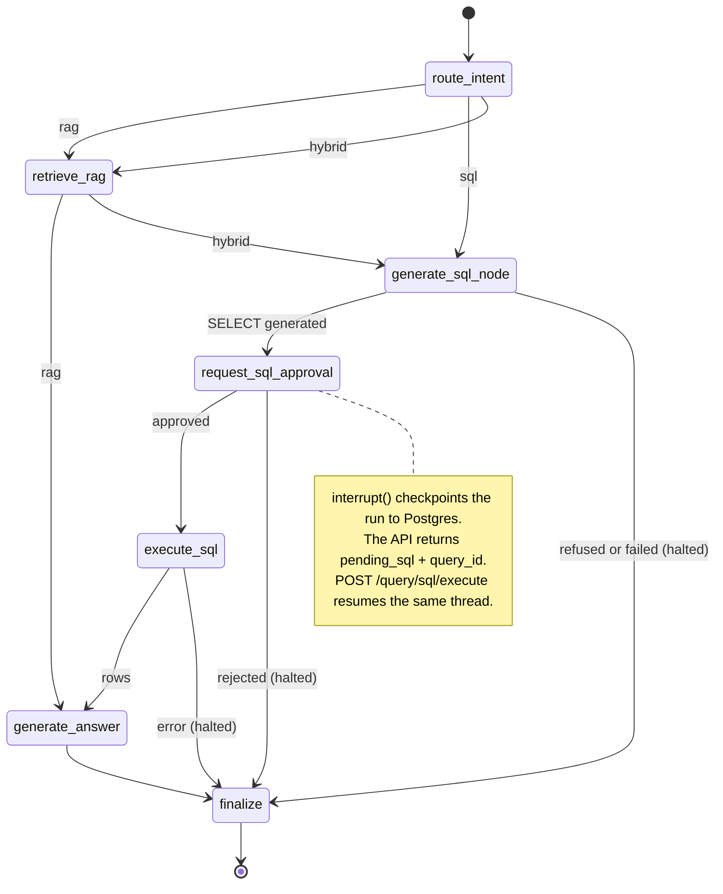
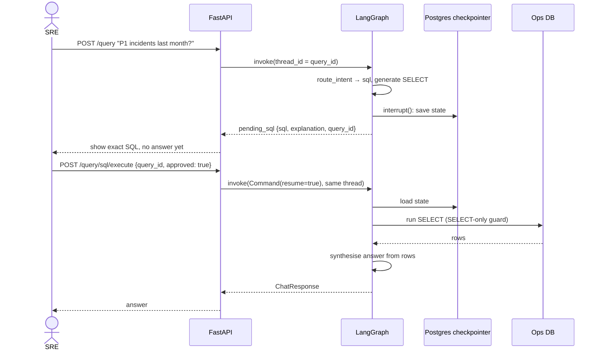
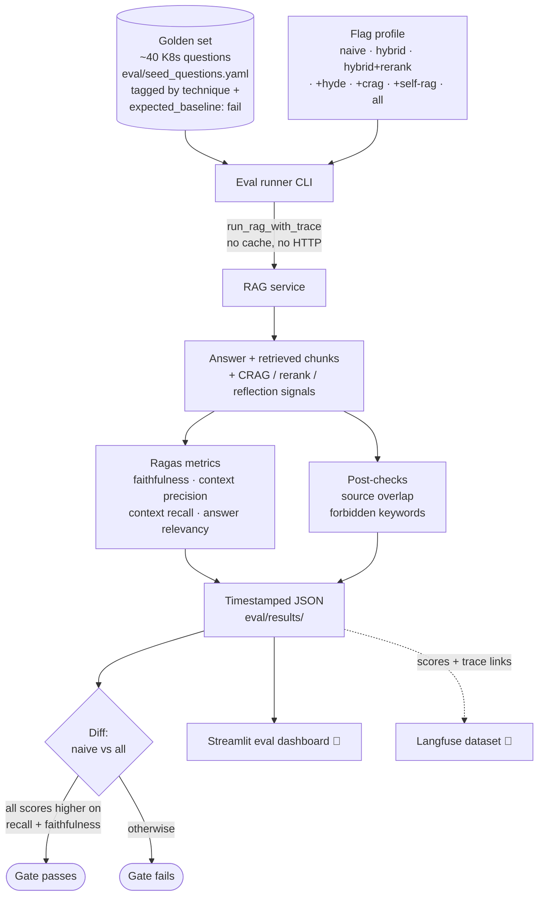

# Enterprise RAG: Kubernetes IT-Operations Copilot

One FastAPI service that answers an SRE's plain-English questions from
documentation (RAG), an operational database (Text2SQL), or both. It sits behind a
layered security pipeline and a multi-tier cache, with a Ragas eval harness for testing.

The document corpus is 95% noise and 5% signal on purpose: about 820 unrelated PDFs and
47 Kubernetes docs. Naïve top-k retrieval returns mostly noise, so each technique here
has to show it can pull the right docs out of it.

> Status legend: ✅ built, 🚧 planned (open GitHub issue)

More detail: [`spec.md`](spec.md) (behaviour spec) · [`CONTEXT.md`](CONTEXT.md) (glossary) ·
[`HANDOFF.md`](HANDOFF.md) (build plan).

---

## 1. System architecture



---

## 2. Advanced RAG

Each technique fixes one way noise breaks naïve retrieval. All are per-request flags
on `POST /query`, so they can be compared and profiled by the eval harness.

| Technique | Fixes | Flag | Status |
|---|---|---|---|
| Dense search (OpenAI embeddings + Qdrant) | Baseline semantic match | `search_mode=dense` | ✅ |
| Sparse search (in-process TF-IDF) | Exact tokens like `CrashLoopBackOff` | `search_mode=sparse` | ✅ |
| Hybrid + Reciprocal Rank Fusion (k=60) | Dense or sparse alone missing a doc | `search_mode=hybrid` | ✅ |
| Cross-encoder reranking | Similar-looking noise ranked above the real answer | `enable_rerank` | ✅ |
| HyDE | Short symptom queries sharing no words with docs | `enable_hyde` | ✅ |
| CRAG + Tavily web fallback | Weak retrieval turning into a confident wrong answer | `enable_crag` | ✅ |
| Self-RAG reflection loop | Weak answers; needless retrieval | `enable_self_reflective` | ✅ |
| Text2SQL + human approval | Questions whose answer is a number in a DB | (router) | ✅ |

### RAG path in detail



The whole path is cached in the `rag_answer` tier (the key includes the flags). If an
optional dependency or API key is missing, that step is skipped instead of failing.

### The graph (routing + Text2SQL)



### SQL approval across two HTTP calls



---

## 3. Guardrails

Every `/query` request goes through the same pipeline in a fixed order. The layer numbers
follow the threat model, not the run order. That is intentional and matches
`projectReport.pdf`, so don't renumber them.

```mermaid
flowchart LR
    A[Request] --> L1[L1<br/>Pydantic + regex<br/>injection patterns]
    L1 --> L4a[L4a<br/>JWT]
    L4a --> L4b[L4b<br/>per-user<br/>rate limit]
    L4b --> L6[L6<br/>token budget<br/>check]
    L6 --> L5[L5<br/>input<br/>restructuring]
    L5 --> L2[L2<br/>llm-guard scan]
    L2 --> L7a[L7a<br/>moderation +<br/>PII redaction]
    L7a --> GEN[[Graph:<br/>L3 hardened prompt<br/>+ L8 spotlighting]]
    GEN --> L7b[L7b<br/>output moderation<br/>+ PII redaction]
    L7b --> L9[L9<br/>schema validation<br/>+ LLM retry]
    L9 --> L6b[consume<br/>token budget]
    L6b --> B[Response]

    classDef done fill:#d4f4dd,stroke:#2b8a3e,color:#000
    classDef todo fill:#fff3bf,stroke:#e67700,color:#000
    class L1,L4a,L4b,GEN done
    class L6,L5,L2,L7a,L7b,L9,L6b todo
```



Green = built, yellow = planned (issue #32).

| Layer | What it stops | How | Status |
|---|---|---|---|
| **L1** Schema + regex | Obvious prompt / script injection | Pydantic validators on free-text fields | ✅ |
| **L4a** JWT | Anonymous access | HS256 bearer token; `is_admin` claim for admin routes | ✅ |
| **L4b** Rate limit | Flooding | Sliding window (Redis sorted set, in-process fallback), per-user on `/query`, per-IP on login/register | ✅ |
| **L6** Token budget | Unbounded LLM spend | Per-user daily counter (100k default); checked before, consumed after | 🚧 |
| **L5** Input restructuring | Over-long input | Truncate or summarise to a token ceiling | 🚧 |
| **L2** llm-guard scan | Injection, toxicity, banned topics | Model-based input scanner beyond regex | 🚧 |
| **L7a / L7b** Moderation + PII | Toxic content, leaked emails / phones / cards / IPs | Redact on input and on final answer | 🚧 |
| **L3** Hardened system prompt | Role changes, prompt disclosure | Marks context as untrusted; forbids persona changes | ✅ |
| **L8** Spotlighting | Indirect injection hidden in a document | Chunks wrapped in `<retrieved_chunk>` tags with a "data, not instructions" preamble | ✅ |
| **L9** Output validation | Malformed model output | Validate against response schema; LLM retry (max 2) | 🚧 |
| **SQL guard** | Data damage via Text2SQL | `SELECT`-only check + keyword blocklist, plus human approval of the exact query | ✅ |

If an optional dependency or key is missing (reranker, Tavily, Redis), that feature is
turned off and the request still completes.

---

## 4. Caching

Five tiers, SHA-256 keys over normalised input, per-tier hit / miss / set stats. Uses
Upstash Redis when configured, otherwise an in-process store.

| Tier | TTL | Notes |
|---|---|---|
| `embedding` | 7 days | Per-text, read-through |
| `intent` | 24 h | Router result |
| `sql_gen` | 24 h | Generated SQL |
| `sql_result` | 15 min | Rows from an approved query |
| `rag_answer` | 1 h | Key **includes the feature flags** |

Admin endpoints: `GET /admin/cache/stats`, `POST /admin/cache/clear`. Repeated identical
queries return `cache_hit: true`. Re-ingesting a file already in the vector store is skipped.

---

## 5. Evals 🚧 (issue #33)

The eval harness guards retrieval quality. It runs the same golden questions under named
flag profiles and checks that each technique scores better than the naïve baseline.



What "passing" means:

- `make eval-baseline` vs `make eval-all`: the all-techniques profile must score higher on
  context recall and faithfulness.
- Goldens tagged `expected_baseline: fail` must pass under their technique's profile.
- Each golden is also checked for source overlap (did we retrieve the right file?) and
  forbidden keywords (did we say something we must not?).

Guardrail evals (planned with #32): a jailbreak / injection / PII set run through
the full pipeline, asserting each attack is blocked or redacted. The demo script (five
representative `curl` calls plus a jailbreak) is the end-to-end acceptance test.

### Test layers

| Layer | Where | Scope |
|---|---|---|
| Unit | `tests/test_*.py` | Each service; OpenAI, Tavily, llm-guard mocked |
| HTTP seam | `tests/test_*_api.py` | End-to-end user stories with a test JWT |
| Graph | `tests/test_graph*.py` | Compiled against `MemorySaver` (no Postgres) |
| Eval | `eval/` 🚧 | Retrieval and answer quality against real APIs |
| Static | `ruff`, `mypy` | Lint + types, run in CI |

---

## 6. Observability 🚧 (issue #37)

Langfuse tracing on `llm_service`, the `rag_service` entry points, and the LangGraph
`invoke`: route, retrieved chunks, every LLM call with token usage, latency, and flags.

- No-op when unconfigured: if `LANGFUSE_*` is unset, nothing changes and nothing crashes.
- Eval linkage: each golden run becomes a trace and the Ragas scores land on a Langfuse
  dataset, so a low score is one click from the trace that caused it.
- Redaction: trace payloads pass through L7 PII redaction before leaving the process.

---

## 7. Roadmap

```mermaid
flowchart LR
    subgraph DONE [Built ✅]
        direction TB
        T19[#19 Skeleton + config] --> T20[#20 Auth + rate limit]
        T20 --> T21[#21 Ops DB + seed]
        T21 --> T22[#22 Embeddings, Qdrant, cache]
        T22 --> T23[#23 Native RAG /query]
        T23 --> T24[#24 Hybrid + RRF]
        T24 --> T25[#25 Reranking]
        T25 --> T26[#26 HyDE]
        T26 --> T27[#27 CRAG + Tavily]
        T27 --> T28[#28 Self-RAG]
        T28 --> T29[#29 LangGraph + router]
        T29 --> T30[#30 Text2SQL + approval]
        T30 --> T31[#31 Caching + dedup]
    end
    subgraph TODO [Planned 🚧]
        direction TB
        T32[#32 9-layer security] --> T33[#33 Ragas eval harness]
        T32 --> T34[#34 Streamlit UI]
        T33 --> T37[#37 Langfuse tracing]
        T33 --> T35[#35 Docker e2e + docs + notebooks]
        T34 --> T35
    end
    T31 --> T32
```



| Ticket | Delivers |
|---|---|
| #32 | L2, L5, L6, L7a/b, L9 + fixed-order wiring |
| #33 | Golden set, flag profiles, Ragas adapter, post-checks, reporting |
| #34 | Streamlit UI: auth, all flag toggles, SQL approve/reject, eval dashboard |
| #35 | `docker compose up` end to end, final docs, notebooks |
| #37 | Langfuse tracing + eval linkage |

---

## 8. Stack

| Concern | Choice |
|---|---|
| Runtime | Python 3.12, `uv` |
| API | FastAPI + uvicorn, PyJWT, bcrypt |
| Orchestration | LangGraph + Postgres checkpointer |
| LLM | OpenAI `gpt-5.4-mini` (answers), `gpt-5.5` (grading / routing / critic) |
| Embeddings | OpenAI `text-embedding-3-small` (1536-dim) |
| Vector store | Qdrant (cosine) |
| Sparse | scikit-learn TF-IDF, in-process |
| Reranker | `cross-encoder/ms-marco-MiniLM-L-6-v2` (local) or Voyage `rerank-2.5` |
| Web fallback | Tavily |
| Relational DB | PostgreSQL 16 |
| Cache | Upstash Redis, in-process fallback |
| Eval / tracing | Ragas 🚧, Langfuse 🚧 |
| Tooling | ruff, mypy, pytest |

## 9. Getting started

```bash
cp .env.example .env      # add OPENAI_API_KEY, JWT_SECRET, etc.
make install
make migrate              # create schema
make seed                 # ingest docs + seed ops DB
make api                  # start the API
make test
```

`docker compose up` for the full stack is planned in #35. See the `Makefile` for the
exact targets currently available.
